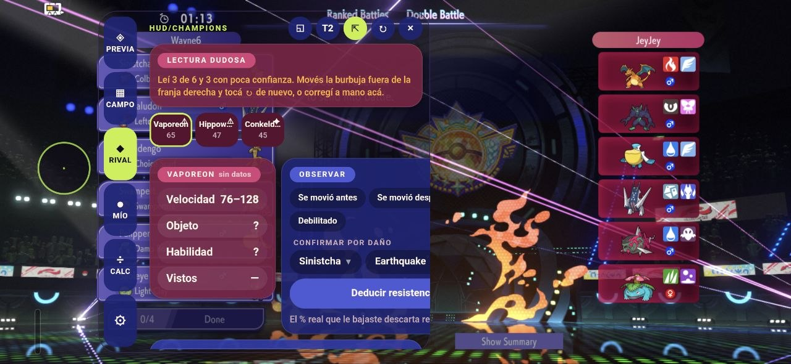
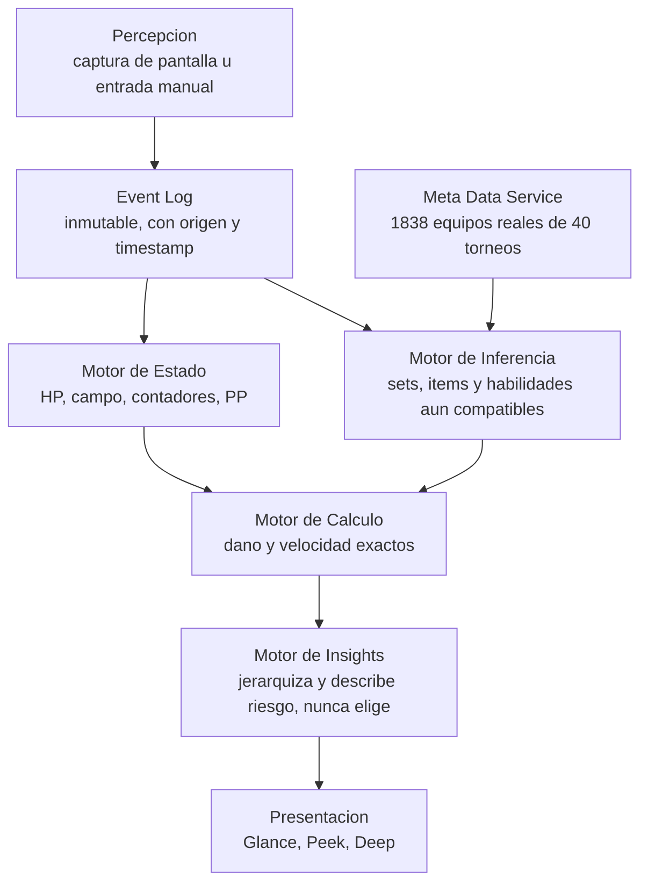

# Champions HUD - Proyecto personal.

> Copiloto y coach de un Maestro Pokémon.

Overlay de batalla en tiempo real para **Pokémon Champions** (VGC) en Android. Lee el equipo rival por visión por computadora, mantiene memoria completa del combate, calcula daño y velocidad exactos, y descarta hipótesis a medida que aparece evidencia — todo esto offline, en el teléfono, sin interrumpir la partida.



---

## Índice

- [Qué hace](#qué-hace)
- [Por qué existe](#por-qué-existe)
- [Arquitectura](#arquitectura)
- [Visión por computadora y captura persistente](#visión-por-computadora-y-captura-persistente)
- [De dónde salen los datos](#de-dónde-salen-los-datos)
- [Disciplina de ingeniería](#disciplina-de-ingeniería)
- [Principios de producto no negociables](#principios-de-producto-no-negociables)
- [Estructura del repo](#estructura-del-repo)
- [Empezar](#empezar)
- [Cómo contribuir si jugás VGC](#cómo-contribuir-si-jugás-vgc)
- [Documentación](#documentación)
- [Qué falta](#qué-falta)
- [Estado actual y próximos pasos](#estado-actual-y-próximos-pasos)
- [Créditos y licencia](#créditos-y-licencia)

## Qué hace

Una burbuja flota sobre el juego. Tocarla abre un panel de cinco pestañas, pensado para horizontal (Champions se juega siempre así) con navegación en un riel vertical en vez de una barra inferior:

| Pestaña | Qué resuelve |
|---|---|
| **PREVIA** | Con tu equipo cargado y el rival escaneado en team preview, estima qué 4 va a sacar y en qué orden, y te recomienda tus 4 con leads y back — pesando control de velocidad, clima, megas duplicadas y choques de habilidad. Muestra el razonamiento, no solo el resultado. |
| **CAMPO** | Qué le hace cada uno de los tuyos a cada uno de ellos, qué te hacen a vos, orden de velocidad y estado del campo con contadores. |
| **RIVAL** | Por cada Pokémon rival: objeto, habilidad y movimientos más probables según meta real, afinados con lo que se confirmó durante la partida — con su nivel de confianza (Confirmado / Deducido / Estimado). |
| **CALC** | Calculadora manual con chips de los 12 Pokémon en juego, autocompletado de objeto/habilidad/campo desde lo ya confirmado, y comparación de variantes lado a lado. |
| **⚙** | Formato, actualización del meta sin recompilar, reinicio de combate. |

El resto se deduce solo, con evidencia inspeccionable: si marcás que un Pokémon "se movió antes" y la velocidad necesaria supera su máximo teórico, el Pañuelo Elección queda confirmado. El rango de velocidad se va cerrando con cada orden de turno observado. "Confirmar por daño" en RIVAL descarta todos los repartos incompatibles con el % real que le bajaste.

Un modo compacto (`◱`) colapsa todo a tres bloques para los últimos segundos del turno: qué tirar, qué te hacen, y el orden de velocidad — con el recomendador explicando *por qué* cada movimiento rinde lo que rinde, sin decir cuál usar.

## Por qué existe

En VGC competitivo, una fracción enorme de las partidas se pierde no por mala estrategia sino por **límites humanos bajo presión de reloj**: no llegás a calcular si tu ataque mata, no te acordás cuántos turnos le quedan a Tailwind, no procesás a tiempo que el rival ya descartó la mitad de sus sets posibles con lo que soltó. Champions HUD no reemplaza el criterio del jugador — reemplaza el trabajo mecánico que le impide usar ese criterio a tiempo.

La regla de producto más importante, refinada dos veces contra uso real (ver `docs/decisions.md` #1, #19, #21), es que **el copiloto describe la posición, nunca elige la acción**. Permitido: hechos, estimaciones con su evidencia, jerarquizar qué mostrar primero, describir riesgos ("el escenario más peligroso es que lleve Pañuelo"). Prohibido sin excepción: "la opción más segura es Protect", rankear tus propios movimientos, cualquier etiqueta tipo "MEJOR". Cada afirmación de riesgo tiene que poder explicarse con la evidencia que la sostiene — si no se puede inspeccionar, no se muestra.

## Arquitectura

El proyecto son dos mitades acopladas por un puente angosto y deliberado:

- **Cascarón Android/Kotlin** (~1.700 líneas, 6 archivos): permisos, ventana flotante `FLAG_NOT_FOCUSABLE`, captura de pantalla, visión por computadora, OCR, persistencia en disco. Es el cliente de la plataforma, no el producto.
- **Motor de dominio** (`hud.html`, JS plano sin dependencias ni módulos — ~4.300 líneas): todo el razonamiento — daño, velocidad, inferencia de sets, predicción de team preview, estado del combate. **No depende de Android en absoluto**: corre y se prueba en un sandbox de Node, sin WebView ni stubs.

Esta separación no es aspiracional: es una propiedad verificada por tests permanentes. El motor referencia el puente Android en exactamente 8 lugares — todos I/O (`loadDex`, `saveBattle`, `loadTeam`, `saveTeam`, `loadMeta`, `loadBattle`, `keepOpen`, `haptic`), agrupados en un único objeto `IO`, nunca lógica de dominio, siempre detrás de una guarda (`typeof Android!=="undefined"`). Un test inyecta una llamada `Android.*` suelta fuera de `IO` a propósito y confirma que la suite la detecta. El motor tampoco menciona licencias, planes ni publicidad en ninguna línea — esos conceptos, cuando existan, viven exclusivamente en la capa de Presentación (`docs/architecture.md` §7).

La arquitectura lógica del motor, tal como está diseñada en `docs/architecture.md`:



El flujo es estrictamente unidireccional y el Event Log es la única fuente de verdad: nada se edita retroactivamente, toda corrección entra como un evento nuevo de máxima confianza y todo lo demás se recalcula desde ahí.

**Honestidad sobre el estado real vs. el diseñado** (algo que el propio proyecto audita explícitamente, ver `docs/architecture.md` §2 y `docs/audit.md`): hoy el Event Log, el Motor de Estado y el Motor de Inferencia todavía no están separados como tres módulos — el estado vive en un objeto mutable y dos reglas de inferencia (`solveBulk()`, `observeOrder()`) escriben su conclusión directo sobre el Pokémon rival. Construir ese sustrato sin reescribir lo que ya funciona es, a propósito, el trabajo activo de la fase actual (`docs/roadmap.md`).

`hud.html` se mantiene deliberadamente como un único archivo sin módulos ES — no es deuda técnica por descuido, es una decisión evaluada y documentada (`docs/decisions.md` #18): el WebView carga el HUD por `file://`, donde Chromium aplica restricciones de CORS a `<script type="module">` que probablemente romperían la carga; y el costo de un paso de build (concatenar módulos) se pesó explícitamente contra el beneficio (editar → recargar el WebView → ver el resultado en segundos, sin recompilar) y se decidió no pagarlo mientras la suite de tests siga siendo el contrapeso real.

## Visión por computadora y captura persistente

**Reconocimiento de sprites en dos pasadas**, corriendo en el teléfono sin red: primero silueta (invariante a shiny — un recoloreo cambia la luminancia, así que compararlo en escala de grises no habría servido); si dos candidatos empatan en silueta, recién ahí se compara color, que es lo que distingue formas como Shellos o separa un shiny (marcado con `✦`) de su versión normal. El fondo degradado de cada tarjeta se resuelve fila por fila usando el borde izquierdo como referencia, en vez de un color de tolerancia fija.

**Por qué la captura de pantalla es persistente:** desde Android 14, el permiso de `MediaProjection` habilita crear **un solo** `VirtualDisplay`. La versión anterior lo creaba y destruía en cada escaneo — el primer escaneo andaba, el segundo tiraba `SecurityException`. Ahora el display se crea una vez y vive lo que vive el HUD; cada escaneo solo pide el último fotograma, sin gastar batería entre escaneos porque el productor se frena solo. Detalle que parecía cosmético y no lo era: el HUD se oculta justo antes de capturar, porque en una pantalla estática no llegan fotogramas nuevos y ese ocultamiento es lo que dispara uno fresco.

**Lectura del equipo propio vía OCR on-device** (ML Kit, variante bundled — el modelo va empaquetado en el APK, no se descarga en el primer uso, consistente con el requisito de offline-first del proyecto). `TeamOCR.kt` deliberadamente solo extrae texto crudo con su posición; interpretar cuál línea es la especie o el ítem vive en `hud.html`, para poder corregir esa lógica editando HTML si el layout real de la pantalla del juego no se comporta como se asumió mirando capturas.

Pensado para un Samsung A55 5G (Android 16 / One UI 8.5): capa por hardware para los 120 Hz del panel, negros profundos para el AMOLED, y `VibrationEffect.EFFECT_TICK` en las barras de PS táctiles para que se sienta como un control nativo de One UI.

## De dónde salen los datos

Todo lo que el motor usa en combate está local — nada depende de una llamada de red para responder dentro de una partida. Tres archivos en `assets/`, generados por scripts de Python y reemplazables sin tocar código:

| Archivo | Lo genera | Contenido real hoy |
|---|---|---|
| `sprite_index.json` | `build_sprite_index.py` | 718 huellas de sprites (incluye variocolor) desde Bulbagarden Archives — ~972 KB |
| `dex.json` | `build_dex.py` | 366 especies, 684 movimientos y sus learnsets desde Pokémon Showdown, recortados a lo que existe en Champions — ~508 KB |
| `meta.json` | `build_meta.py` + `build_meta_v2.py` | Uso real de **1.703 equipos de 40 torneos** de la API pública de Limitless TCG (Reg. M-B), fusionado con reparto de EVs y naturaleza de Champions Battle Data (235/236 especies) — ~280 KB |

`meta.json` trae metadatos de procedencia en el propio archivo (`source`, `sourceCounts`, `generatedAt`, `partial`) para que el HUD sepa distinguir datos reales de estimados y avisarlo en pantalla en vez de mostrar falsa precisión.

### Actualizarlos: un comando

Los tres se regeneran con `update_data.py`, en el nivel que corresponda a lo que cambió:

```bash
python update_data.py meta       # semanal — el meta de torneos se mueve solo
python update_data.py dex        # parche de balance: nerfeos, bufeos, stats
python update_data.py completo   # Pokémon u objetos NUEVOS en Champions
```

Cada nivel corre todo lo que está río abajo, porque las dependencias son reales: `sprites → dex → meta → meta+CBD`. Solo `completo` arranca en sprites, que es el único paso capaz de descubrir especies nuevas y el único que tarda minutos.

**Nada pisa `assets/` hasta que `validate_data.py` da OK** sobre lo recién generado: se genera en `_staging/`, se valida ahí, y recién entonces se promueve. Si falla, lo instalado sigue intacto.

Para publicarlos a usuarios ya instalados, sin APK nuevo: `python build_data_manifest.py` arma `dist/` para subir a cualquier hosting estático. La app baja un manifiesto de <1 KB, compara, y descarga solo lo que cambió — con `sha256` por archivo y validación antes de reemplazar lo que ya funcionaba. Ver `docs/architecture.md` §10.7.

Sin `dex.json` la app arranca igual con tablas mínimas embebidas; sin `sprite_index.json` todo funciona salvo el escaneo. Ningún dato pierde disponibilidad de golpe — degradación elegante, no un interruptor de todo o nada.

## Disciplina de ingeniería

- **236 tests, cero dependencias externas.** `tests/run.js` extrae el motor de `hud.html` (todo antes de `function vPre(){`) y lo corre en un sandbox de `vm` de Node con un `localStorage` simulado — sin Jest, sin npm install. Cubre el pipeline evento → estado → inferencia → cálculo, la fórmula de stats contra 12 valores reales tomados de capturas del juego, y contratos de datos.
- **Bugs reales se convierten en tests permanentes, no en parches puntuales.** El bug más repetido del proyecto (encontrado tres veces): `meta.json` guarda movimientos en inglés, la tabla `MV` de `hud.html` está keyeada en español — comparar directo no matcheaba nunca y fallaba en silencio. Ahora hay un test de contrato que verifica que **todo** nombre que entrega `meta.json` — movimientos, sets, ítems, habilidades — el motor lo sabe resolver: medido en **0 fallos sobre 1.279 movimientos, 1.563 movimientos de sets, 564 ítems y 307 habilidades**, y probado inyectando un nombre inválido a propósito para confirmar que el test sí falla cuando corresponde.
- **"Fallo ruidoso, nunca silencioso"** es un principio de arquitectura, no un eslogan (`docs/decisions.md` #8): nace directamente de bugs reales donde el sistema seguía reportando éxito mientras producía un resultado incorrecto. Ante datos inconsistentes, el HUD lo dice explícitamente en vez de degradar en silencio y mostrar un número plausible pero falso.
- **Validación de datos en build.** `validate_data.py` corre antes de empaquetar y confirma que `meta.json`, `dex.json`, `sprite_index.json` y las tablas embebidas son mutuamente consistentes.
- **La fórmula de stats está verificada, no asumida.** Champions no usa IVs — todos los Pokémon cuentan 31 en las seis stats, y `1 SP = +1 punto de stat a nivel 50, sumado antes de la alineación`. Verificado contra la pantalla de stats real del juego con 10 valores de 6 Pokémon distintos (ej. Gholdengo con 32 SP: `floor((153+32)*1.1) = 203`, exacto). Dos de esos Pokémon (Grimmsnarl, Aegislash) son ahora un test permanente que falla si alguien toca la fórmula sin querer.
- **Auto-auditoría versionada.** El proyecto mantiene su propio archivo de auditoría técnica (`docs/audit.md`), re-ejecutado contra el código real varias veces, que documenta explícitamente qué está resuelto, qué sigue vigente y qué se descartó por evidencia — incluida la vez que un hallazgo de una auditoría anterior ya no reproducía y se cerró en vez de dejarlo como TODO fantasma.
- **Decisiones de arquitectura registradas, no en la memoria de una sesión de chat.** 26 decisiones numeradas en `docs/decisions.md`, cada una con contexto, la decisión en sí, sus consecuencias aceptadas y su estado — incluyendo matices posteriores que corrigieron una regla demasiado estricta contra uso real, en vez de reescribirla en silencio.

## Principios de producto no negociables

De `docs/vision.md` y `docs/decisions.md`, la base contra la que se evalúa cualquier feature nueva:

- **El copiloto describe, nunca decide.** Ver [Por qué existe](#por-qué-existe).
- **No duplicar lo que el juego ya muestra.** Contadores de Tailwind, clima o pantallas ya están en pantalla nativa; el HUD solo agrega si aporta algo que el juego no da.
- **Offline-first real**, no una degradación aceptable: ningún módulo del pipeline de combate depende de una llamada de red para responder dentro de una partida.
- **Identificadores de dominio en inglés (slugs canónicos), idioma solo en presentación** — nunca comparar por nombre traducido en lógica de dominio. Esta regla existe porque violarla fue la causa raíz de un bug real y grave (ver arriba).
- **Motor agnóstico de plataforma.** El overlay Android es el primer cliente del motor, no el motor mismo — pensado para que un futuro cliente en otra plataforma consuma la misma lógica sin reescribirla.
- **Confianza calibrada, nunca falsa precisión.** Cada dato se muestra como hecho confirmado, deducción con evidencia inspeccionable, o estimación de meta — nunca disfrazado de certeza.

## Estructura del repo

```
ChampionsHUD/
├── app/src/main/
│   ├── assets/
│   │   ├── hud.html          # Motor de dominio completo — JS plano, sin dependencias
│   │   ├── dex.json          # Especies/movimientos/learnsets (generado, no versionado a mano)
│   │   ├── meta.json         # Uso real de torneos (generado, no versionado a mano)
│   │   └── sprite_index.json # Huellas de sprites (generado, no versionado a mano)
│   └── java/com/angel/championshud/
│       ├── MainActivity.kt      # Onboarding y permisos secuenciales
│       ├── OverlayService.kt    # Ventana flotante, puente JS↔Kotlin, arrastre, vibración
│       ├── ScreenCapture.kt     # MediaProjection + VirtualDisplay persistente
│       ├── SpriteMatcher.kt     # Reconocimiento de Pokémon en dos pasadas
│       ├── TeamOCR.kt           # OCR on-device (ML Kit) del equipo propio
│       └── Storage.kt           # Persistencia, actualización por internet, haptics
├── update_data.py             # ← Punto de entrada: regenera los datos en 1 comando
├── build_data_manifest.py     # Empaqueta dist/ para publicar datos sin APK nuevo
├── build_sprite_index.py     # Genera sprite_index.json (fuente enchufable, ver contingencia)
├── build_dex.py               # Genera dex.json desde Pokémon Showdown
├── build_meta.py               # Genera meta.json desde la API de Limitless TCG
├── build_meta_v2.py            # Fusiona reparto de EVs/naturaleza de Champions Battle Data
├── validate_data.py            # Valida consistencia mutua de los datasets antes de empaquetar
├── tests/
│   ├── run.js                  # 236 tests del motor, sandbox de Node sin dependencias
│   ├── test_build_meta.py
│   ├── test_build_meta_v2.py
│   └── test_sprite_provider.py  # Contrato de las fuentes de sprites
├── docs/                       # Visión, arquitectura, decisiones (ADR), auditoría, roadmap
├── GUIA-INSTALACION.md         # Guía paso a paso sin asumir experiencia previa con Android
└── CLAUDE.md                   # Puntero de contexto para desarrollo asistido por IA
```

## Empezar

### Como jugador

Seguí [`GUIA-INSTALACION.md`](./GUIA-INSTALACION.md) — está escrita asumiendo que nunca compilaste una app Android, de punta a punta (~40-60 minutos, casi todo esperando descargas).

### Como desarrollador

```bash
git clone https://github.com/PullAngel/ChampionsHUD.git
cd ChampionsHUD

# Datos del motor (opcional para desarrollar el motor; obligatorio para compilar
# con reconocimiento de sprites y learnsets completos).
# Genera, VALIDA y recién entonces instala en assets/ — si algo no cierra,
# lo que ya estaba sigue intacto.
pip install -r requirements.txt
python update_data.py completo

# Correr la suite completa — motor (JS) + generadores (Python) + validación de
# datos, todo con una sola orden. No requiere Android Studio ni un dispositivo.
node tests/run.js

# Compilar el APK
./gradlew assembleDebug   # queda en app/build/outputs/apk/debug/
```

Casi todo el trabajo de motor/producto se hace editando `hud.html` directamente y corriendo `node tests/run.js` — no hace falta Android Studio ni un dispositivo para iterar sobre daño, velocidad, inferencia o predicción.

**Requisitos:** Android Studio (con el SDK 35), Python 3.10+, Node.js (sin dependencias adicionales — la suite de tests usa solo el runtime estándar).

## Cómo contribuir si jugás VGC

El proyecto es personal/comunitario y las formas de aportar más valiosas hoy no son necesariamente código:

- **Capturas de escaneo fallido.** El recorte de tarjetas en `SpriteMatcher` está calibrado a ojo contra un Samsung A55; si el escaneo confunde especies o falla en tu teléfono, una captura de la pantalla de team preview es el insumo más útil que existe para corregirlo.
- **Datos de meta reales**, si tenés acceso a repartos, sets o resultados de torneos que las fuentes actuales (Limitless TCG, Champions Battle Data) no cubran.
- **Verificación contra el juego real.** Varios cambios recientes (formato de stats, mecánicas de habilidad como Robustez) se validan contrastando contra capturas reales del juego — más ejemplos de distintas especies y situaciones ayudan a encontrar los próximos casos borde.
- **Feedback de uso**, sobre todo en el punto donde más falla hoy (`docs/audit.md`): el recorte automático de las tarjetas del rival en team preview.

Antes de tocar código de producto, `CLAUDE.md` y `docs/vision.md` explican la regla no negociable del proyecto (el copiloto describe, nunca decide) y cómo verificar que un cambio no la contradiga.

## Documentación

El repo mantiene documentación de producto y arquitectura versionada junto con el código, en vez de dejarla vivir solo en el historial de una conversación:

| Archivo | Para qué sirve |
|---|---|
| [`docs/vision.md`](./docs/vision.md) | Filosofía y principios del producto — el punto de partida |
| [`docs/product.md`](./docs/product.md) | Personas, flujo de batalla, capas de interfaz (Glance/Peek/Deep) |
| [`docs/architecture.md`](./docs/architecture.md) | Diseño técnico, modelo de datos, puntos de extensión reservados |
| [`docs/inference.md`](./docs/inference.md) | Modelo de conocimiento: event log, hipótesis, reglas, evidencia |
| [`docs/decisions.md`](./docs/decisions.md) | Registro de decisiones de arquitectura (ADR), 26 entradas numeradas |
| [`docs/audit.md`](./docs/audit.md) | Auditoría técnica del estado real del código, re-ejecutada contra el HEAD |
| [`docs/roadmap.md`](./docs/roadmap.md) | Fases del proyecto, criterios de salida, qué sigue |
| [`docs/calc.md`](./docs/calc.md) | Diseño de la pestaña CALC: auditoría de alternativas, decisiones táctiles |
| [`docs/future.md`](./docs/future.md) | Lo que se pospuso a propósito, y por qué |

## Qué falta

Honesto y actualizado, no una lista de aspiraciones:

- La tabla `SPD` de velocidades base en `hud.html` cubre ~42 especies y 11 megas; falta el roster legal completo.
- El motor de movimientos no modela efectos secundarios, precisión real, golpes múltiples ni PP consumido.
- Intimidación no se aplica sola todavía — hay que marcar la etapa manualmente en CAMPO.
- Sin Teratipos: Champions todavía no los tiene en el juego; el motor está armado para poder sumarlos sin rehacerse.
- Sin seguimiento de Protección ni de objetos consumidos (Baya Zidra usada, Banda Focus gastada) — se cuenta mentalmente por ahora.
- El recorte de tarjetas de `SpriteMatcher` es la causa más frecuente de errores de reconocimiento reportados, y necesita capturas reales de más dispositivos para recalibrarse.
- El algoritmo de predicción de "quién va a sacar" (`predict()`) probó ser poco confiable contra una partida real y quedó relegado mientras se diseña algo mejor sobre datos reales de meta, en vez de ajustar pesos a ciegas.

## Estado actual y próximos pasos

Las Fases 0–2 (estabilización, reducción de fricción crítica, datos de meta reales + motor de inferencia por eliminación) están cerradas. Desde entonces el trabajo avanza contra uso real del propio autor, documentado en `docs/roadmap.md` bajo "Post-Fase 2": rediseño de comunicación con el jugador, corrección de bugs reportados con capturas de dispositivo real, deducción de naturaleza por aritmética en vez de lectura de imagen, y la primera mitad de memoria entre partidas de una serie (Bo3) — lo confirmado sobre el rival se arrastra al juego siguiente, lo deducido no.

La separación formal Motor/Cliente (Fase 3) resultó estar de hecho ya cumplida al auditarla — el motor corre y se prueba sin Android desde la Fase 0 — y lo que faltaba (que las 8 llamadas de I/O vivan agrupadas en un adaptador con nombre, `IO`, en vez de sueltas) ya está hecho y tiene test propio.

Lo que sigue, sin resolver todavía: la segunda mitad de la Fase 4 (resumen post-combate completo — qué acertó y qué falló el modelo — y una vista para repasar una serie entera), que es explícitamente una conversación de producto antes que una tarea de código. Las decisiones de negocio (licencia, publicidad, distribución) están deliberadamente sin tomar y no condicionan la arquitectura actual — ver `docs/future.md`.

## Créditos y licencia

Sprites: [Bulbagarden Archives](https://archives.bulbagarden.net/), CC BY-NC-SA 2.5. Proyecto personal, sin fines comerciales — Pokémon y Pokémon Champions son marcas de sus respectivos dueños; este proyecto no tiene afiliación con ellos.
